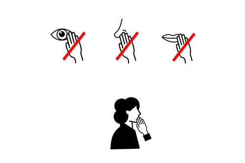

<h1 align="center">
  <br>
  <a href="https://do-not-touch-you-face.glitch.me/"></a>
</h1>

### Hackaton project
This project was created as part of a hackathon dedicated to fighting the spread of coronavirus infection. 
The following features are implemented in the current version:
1) Segmentation of a person's face and palms
2) Face touch detection
3) Playing an audible signal in case of touching


### How to use

To clone and run this application, you'll need Git. From your command line:

```
# Clone this repository
$ git clone https://github.com/Arcady1/Do-not-touch-your-face.git

# Go into the repository
$ cd Doodle-Recognition-Web/web-page

# Open index.html file
```

### Credits
This software uses the following open source packages:

* [jQuery][2] v3.5.1
* [TensorFlow.js][3] v1.0.0
* [BodyPix - Person Segmentation][4] v2.0

### Acknowledgments
* [TensorFlow Blog](https://blog.tensorflow.org/search?label=TensorFlow.js&max-results=20)<br>
* [BodyPix: Real-time Person Segmentation in the Browser with TensorFlow.js](https://blog.tensorflow.org/2019/11/updated-bodypix-2.html) - The full article on BodyPix segmentation at TenserFlow Blog<br>

### You may also like...
* [Doodle Recognition](https://github.com/Arcady1/Doodle-Recognition-Web) - Web app classsificator based on the Quick, Draw! Dataset.
* [Pomodoro Bot](https://github.com/Arcady1/Telegram-Pomodoro-Bot) - Telegram bot with the pomodoro timer

### License
MIT

[1]: https://do-not-touch-you-face.glitch.me/
[2]: https://github.com/jquery/jquery
[3]: https://github.com/tensorflow/tfjs
[4]: https://github.com/tensorflow/tfjs-models/tree/master/body-pix
