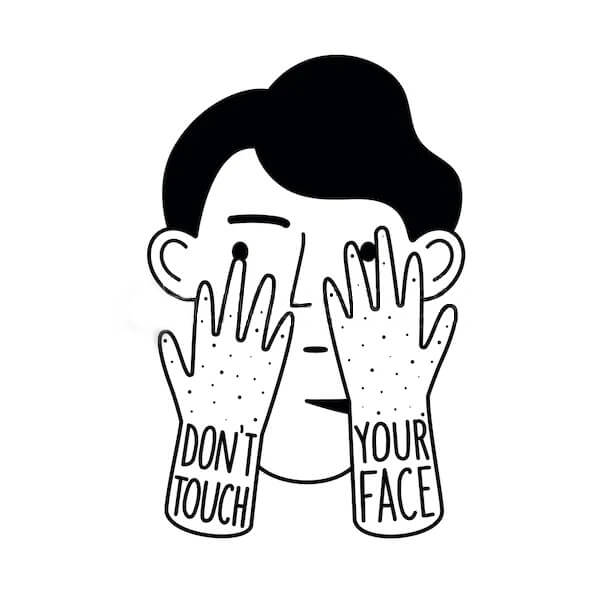

  
<h1 align="center">
  <a href="https://do-not-touch-you-face.glitch.me/">
    </img>
  </a>
  <br>
  <a href="https://do-not-touch-you-face.glitch.me/">Don't touch your face!</a>
  <br>
</h1>

This project was created as part of a hackathon dedicated to fighting the spread of coronavirus infection
<br>
<br>
<b>Problem:</b> People unconsciously touch their faces while working at the computer
<br>
<b>Idea:</b> Track user face and palms with the webcam using the TensorFlow BodyPix and make sound notification

![face-GIF][0]
In the GIF, a video has been inserted for clarity

### How it works
* Open this [DEMO][1]
* Allow access to the camera
* Touch your face to hear the warning tone

### How to use

To clone and run this application, you'll need Git. From your command line:

```
# Clone this repository
$ git clone https://github.com/Arcady1/Do-not-touch-your-face.git

# Go into the repository
$ cd Doodle-Recognition-Web/web-page

# Open index.html file
```

### Credits
This software uses the following open source packages:

* [jQuery][2] "v3.5.1"
* [Browserify][2.5] "^17.0.0"
* [TensorFlow.js][3] "1.0.0"
* [BodyPix - Person Segmentation][4] "2.0"

### Acknowledgments
* [TensorFlow Blog](https://blog.tensorflow.org/search?label=TensorFlow.js&max-results=20)<br>
* [BodyPix: Real-time Person Segmentation in the Browser with TensorFlow.js](https://blog.tensorflow.org/2019/11/updated-bodypix-2.html) - The full article on BodyPix segmentation at TenserFlow Blog<br>

### You may also like...
* [Doodle Recognition](https://github.com/Arcady1/Doodle-Recognition-Web) - Web app classsificator based on the Quick, Draw! Dataset.
* [Pomodoro Bot](https://github.com/Arcady1/Telegram-Pomodoro-Bot) - Telegram bot with the pomodoro timer

### License
MIT

[0]: https://github.com/Arcady1/Do-not-touch-your-face/blob/master/web-page/icon/v2.gif
[1]: https://do-not-touch-you-face.glitch.me/
[2]: https://github.com/jquery/jquery
[2.5]: https://github.com/browserify/browserify
[3]: https://github.com/tensorflow/tfjs
[4]: https://github.com/tensorflow/tfjs-models/tree/master/body-pix
